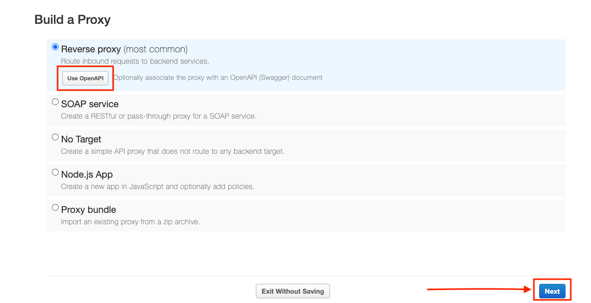
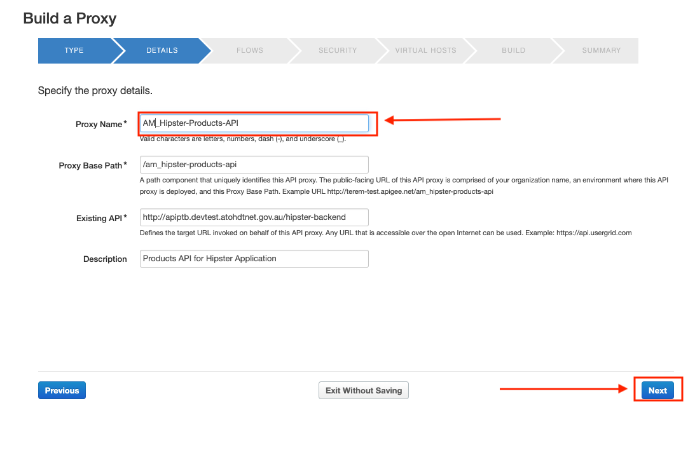
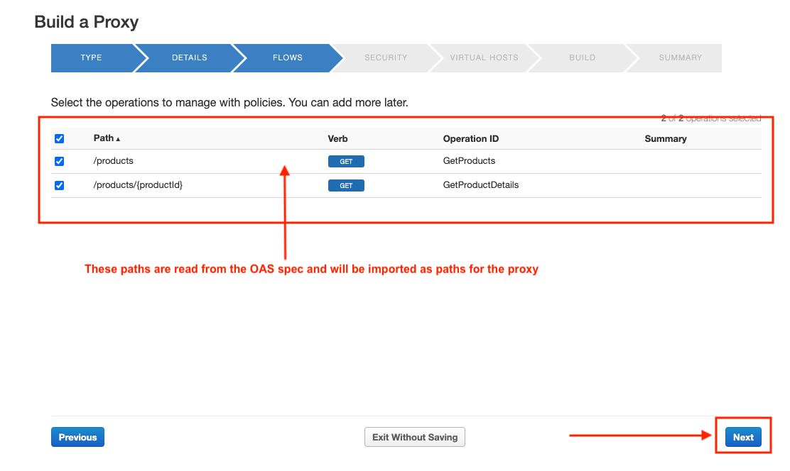
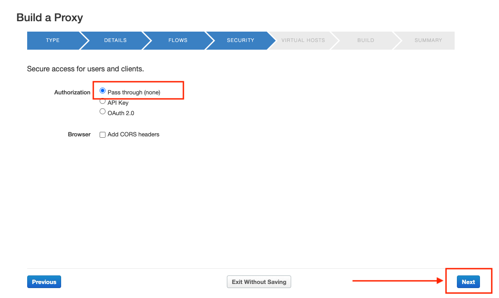
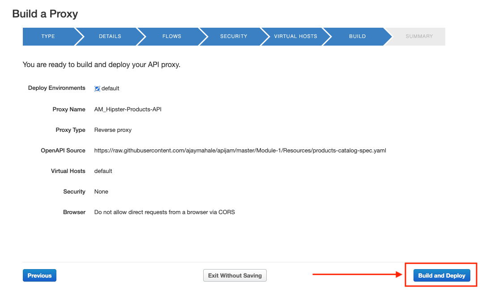

# Lab 1 - Design & Create an API Proxy with OpenAPI Specification

*Duration : 15 mins*

*Persona : API Team*

# What does this lab cover ?
In this simple lab you will learn how to use Apigee to proxy an existing backend using an OpenAPI Specification and the Apigee proxy wizard.

# Use case

You have a requirement to create a reverse proxy to handle requests from the Internet and forward them to an existing service. You have decided to follow a design first approach and built a reusable component, a specification which can be used to describe the API contract, generate API documentation, generate API test cases, etc., using the OpenAPI Specification. You would like to generate an Apigee API Proxy by using the OpenAPI Specification (fka: Swagger) instead of building the API Proxy from scratch.

# How can Apigee API Management help?

Apigee enables you to quickly expose services as APIs.  You do this by creating an [**API proxy**](https://docs.apigee.com/api-platform/fundamentals/understanding-apis-and-api-proxies#whatisanapiproxy), which provides a facade for the service that you want to expose, such as existing API endpoints, generic HTTP services, or applications (such as Node.js). The API proxy decouples your service implementation from the API endpoint that developers consume. This shields developers from future changes to your services as well as implementation complexities. As you update services, developers, insulated from those changes, can continue to call the API, uninterrupted.
On Apigee, the API Proxy is also where runtime policy configuration is applied for API Management capabilites. For further information, please see: [Understanding APIs and API Proxies](https://docs.apigee.com/api-platform/fundamentals/understanding-apis-and-api-proxies#whatisanapiproxy).


Apigee also supports the [**OpenAPI specification**](https://github.com/OAI/OpenAPI-Specification) out of the box, allowing you to auto-generate API Proxies. 

In this lab, we will learn how to
* design an OpenAPI specification for an existing HTTP service and store it within the Apigee platform, and
* create an API proxy that routes inbound requests to an existing HTTP service.

# Pre-requisites

* Basic understanding of [OpenAPI Specification](https://github.com/OAI/OpenAPI-Specification) (FKA: Swagger)
* Access to an HTTP client to test the API (eg. cURL, Postman, Fiddler etc.). If you do not have access to one, you can use the [Apigee Trace Tool](https://docs.apigee.com/api-platform/debug/using-trace-tool-0).

# Instructions

**Note: During this workshop, as you may be working within an [Apigee Organization (Org)](https://docs.apigee.com/api-platform/fundamentals/apigee-edge-organization-structure) that is shared by multiple users.  Please prefix all asset names within the Org with your initials. For example, Spec name = {your-initials}\_{spec name}, API proxy name = {your-initials}\_{proxy name}, etc.**

## Create an API Proxy

##### 1. It’s time to create Apigee API Proxy from an OpenAPI Specification. Click on **Develop → API Proxies** from side navigation menu.


##### 2. Click **+Proxy** The Build a Proxy wizard is invoked.


##### 3. Select **Reverse proxy**, Click on **Use OpenAPI** below reverse proxy option.



##### 4. Add https://raw.githubusercontent.com/ajaymahale/apijam/master/Module-1/Resources/products-catalog-spec.yaml to the textbox to enter the OAS 


##### 6. Enter details in the proxy wizard. Replace **{your-initials}** with the initials of your name.

    * Proxy Name: **{your_initials}**\_Hipster-Products-API

    * Proxy Base Path: /v1/**{your_initials}**\_hipster-products-api




##### 7. Verify the values and click **Next**.

##### 8. You can select which API resources, from the list configured in the OpenAPI Spec, should be exposed. Select all & Click on **Next**

    * Existing API: Observe the field value which is auto filled from OpenAPI Spec.




##### 9. Select **Pass through (none)** for the authorization in order to choose not to apply any security policy for the proxy. Click Next.




##### 10. Ensure that the **default** one is checked.


##### 11. Ensure that only the **test** environment is selected to deploy to and click **Create and Deploy**



##### 12. Once the API proxy is created and deployed click **Edit Proxy** to view your proxy in the proxy editor.


##### 13. *Congratulations!* ...You have now built a reverse proxy for an existing backend service. You should see the proxy **Overview** tab.


## Test the API Proxy
Let us test the newly built API proxy. You can use any HTTP client like cURL or Postman, or the [Apigee Trace Tool](https://docs.apigee.com/api-platform/debug/using-trace-tool-0).


### Using Trace Tool:

* Navigate to your proxy's **Trace** tab.

* Ensure that the deployed API revision is selected.

##### * Hit **Start Trace Session**.


* Wait for Trace session to start.

* Modify the URL to send to a valid API resource - **append a '/products' to the end of the URL.**

##### * Hit 'Send'.


##### * You will see that the API proxy recieved the request and sent back a HTTP status 200 response which was logged by the Trace session. You can click on the step shown below to view the response body.


### Using cURL(Optional)
To test the get call with an http client like cUrl

```
curl -X GET "http://apiptb.devtest.atohdtnet.gov.au/v1/{{your initials}}_hipster-products-api/products"
```


## Save the API Proxy

##### 1. Let’s save the API Proxy locally as an API Bundle so that we can reuse it in other labs.

##### 2. Save the API Proxy by downloading the proxy bundle, See screenshot below for instructions.


# Lab Video

If you like to learn by watching, here is a short video on creating a reverse proxy using OpenAPI Specification - [https://www.youtube.com/watch?v=3XBG9QOUPzg](https://www.youtube.com/watch?v=3XBG9QOUPzg)

# Earn Extra-points

Now that you have created a reverse proxy using an OpenAPI spec, click on the Develop tab and explore the flow conditions populated from the OpenAPI spec.  Further explore the trace tab in the API Proxy editor which supports filtering traces as well as downloading trace data for offline use.  

# Quiz

1. How do you import the proxy bundle you just downloaded?
2. How does Apigee handle API versioning?
3. Are there administrative APIs to create, update, or delete API proxies in Apigee?

# Summary

That completes this hands-on lesson. In this simple lab you learned how to use Apigee to proxy an existing backend using an OpenAPI Specification and the Apigee proxy wizard.

# References

* Useful Apigee documentation links on API Proxies -

    * Build a simple API Proxy - [http://docs.apigee.com/api-services/content/build-simple-api-proxy](http://docs.apigee.com/api-services/content/build-simple-api-proxy)

    * Best practices for API proxy design and development - [http://docs.apigee.com/api-services/content/best-practices-api-proxy-design-and-development](http://docs.apigee.com/api-services/content/best-practices-api-proxy-design-and-development)

* Watch this "4 Minute Video 4 Developers" (4MV4D) on "Anatomy of an API Proxy" - [https://youtu.be/O5DJuCXXIRg](https://youtu.be/O5DJuCXXIRg)

# Rate this lab

How did you like this lab? Rate [here](https://goo.gl/forms/G8LAPkDWVNncR9iw2).

Now go to [Lab-2](../Lab%202)
