# Lab 4 - Build an App Developer Experience using Apigee

*Duration : 30 mins*

*Persona : API Team*

# What you will learn
* Browse the Developer Portal and explored it's features
* Publish an API Product with an OpenAPI Specification
* Use the Developer Portal UI to browse the OpenApi Specification Snapshot as a developer.

# Use case

You want to provide and manage an easy, self-service on-boarding experince for app developers who wish to consume your API Products via a Developer Portal.  You want to enable app developers to learn about, register for, and begin using your APIs, as well as control visibility and access to different API Products.

# How can Apigee Edge help?

Apigee Edge provides multiple options for your Developer Portal. Apigee supports several developer portal solutions, ranging from simple turn-key to fully customizable and extensible. The turn-key [Integrated Developer Portal](https://docs.apigee.com/api-platform/publish/portal/build-integrated-portal) option supports branding and customization of much of the site, such as theme, logos, and page content, and can be published in seconds, directly from the management UI.  We also provide a [Drupal-based portal](https://docs.apigee.com/api-platform/publish/drupal/open-source-drupal-8) if you want full control and to leverage any of the hundreds of Drupal modules available in the Drupal Market.  This lab focuses on the Integrated Developer Portal.

In this lab, we will explore the developer portal pre-installed within the ATO.
* learn API usage through OpenAPI specification based interactive documentation
* register Apps that consume API Products, and thereby
* generate App client credentials (API Key and Secret) that can be used to consume APIs.

# Pre-requisites

For this lab, you should have completed [Lab 1](../Lab%201), [Lab 2](../Lab%202) and [Lab 3](../Lab%203) of this module.

You will need…

* An OpenAPI specification uploaded to your Spec store within your Organization. This specification will make up the documentation of your API.  If you do not have an OpenAPI Specification available for this lab, revisit [*Lab 1 - Design & Create an API Proxy with OpenAPI Specification*](../Lab%201)
* API Products that bundle your API Proxies. If you do not have an API Product configured, revisit [*Lab 2 - API Security and API Producer/Consumer Relationship on Apigee Edge*](../Lab%202), and [Lab 3 - Manage tiered API Product subscription through API call quotas](../Lab%203).

# Instructions

## Update API Proxy for CORS Support

CORS (Cross-origin resource sharing) is a standard mechanism that allows JavaScript XMLHttpRequest (XHR) calls executed in a web page to interact with resources from non-origin domains. CORS is a commonly implemented solution to the "[same-origin policy](https://en.wikipedia.org/wiki/Same-origin_policy)" that is enforced by all browsers. For example, if you make an XHR call to your API Proxy from JavaScript code executing in your browser, the call will fail. This is because the domain serving the page to your browser is not the same as the domain serving your API, eg. "{your org name}-{environment name}.apigee.net". CORS provides a solution to this problem by allowing servers to "opt-in" if they wish to provide cross-origin resource sharing.

In this step, we upload and deploy a version of your API proxy which includes configurations that support CORS, before it is published to a Developer Portal where it could be invoked within interactive docs pages. Typically, you would set these configurations up as described under "[Adding CORS support to an API proxy](https://docs.apigee.com/api-platform/develop/adding-cors-support-api-proxy)". However, in the interest of time, in this lab, we will make use of a pre-configured proxy revision instead.

#### 1. Download [this revision](https://github.com/ajaymahale/apijam/raw/master/Module-1/Resources/Hipster-Products-API_With_CORS_Config_new3.zip) of the API proxy. This is a version of the same Hipster Products API that we have been working on so far, but with CORS configurations.

#### 2. Navigate to **API Proxies** and select your Hipster Product API proxy. Then click the **Project** button and select **Upload a New Revision**.

In the pop-up dialog, choose the previously downloaded revision of the API proxy, and click **Upload**.

#### 3. Once uploaded, in the latest revision of your API proxy, navigate to the **Proxy Endpoints** >> **default** XML, scroll down and change the `<BasePath>` node value to match your proxy's basepath.

Hit **Save**.

#### 4. Once saved, select the **Deployment** drop down and click on **test**, to undeploy the older revision and deploy the latest revision of the proxy to the test environment.

Your API proxy should now include configurations to support CORS processing.

## Create a Catalog Item in the Developer Portal

#### 1. Navigate to the developer Portal(refer to emailed Getting Started sheet for urls) and Login as a content creator

#### 2. Login to the Portal as a content editor

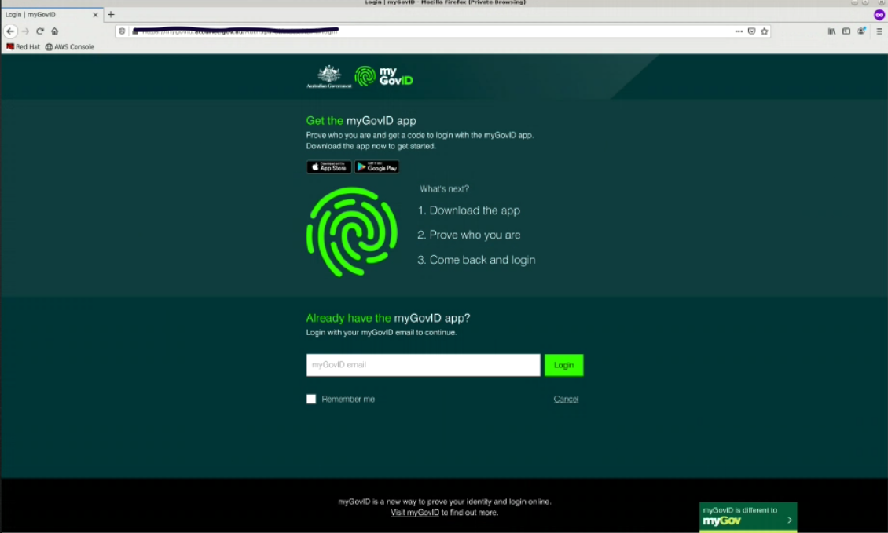

##### Enter user : dis-ptb50@test.gov.au

#### 3. Click **Content**

#### 4. Click **Add Content** and then **API Doc**
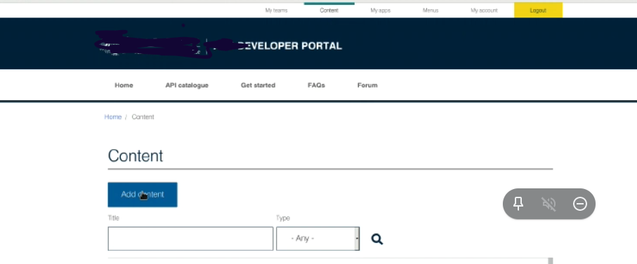

#### 5. Create a new Api Catalog item and upload the [OAS spec](https://raw.githubusercontent.com/ajaymahale/apijam/master/Module-1/Resources/products-catalog-spec.yaml)

#### 6. View how the catalog item would look on the developer portal

## Ensure that Bronze (Free) API Product is accessible as Public

#### 1. Visit the Apigee Edge
#### 2. Find your Bronze Api Product 
#### 3. Ensure that it's access is public

## App Developer sign-up & Register Apps

#### 1. Browse to the developer Portal
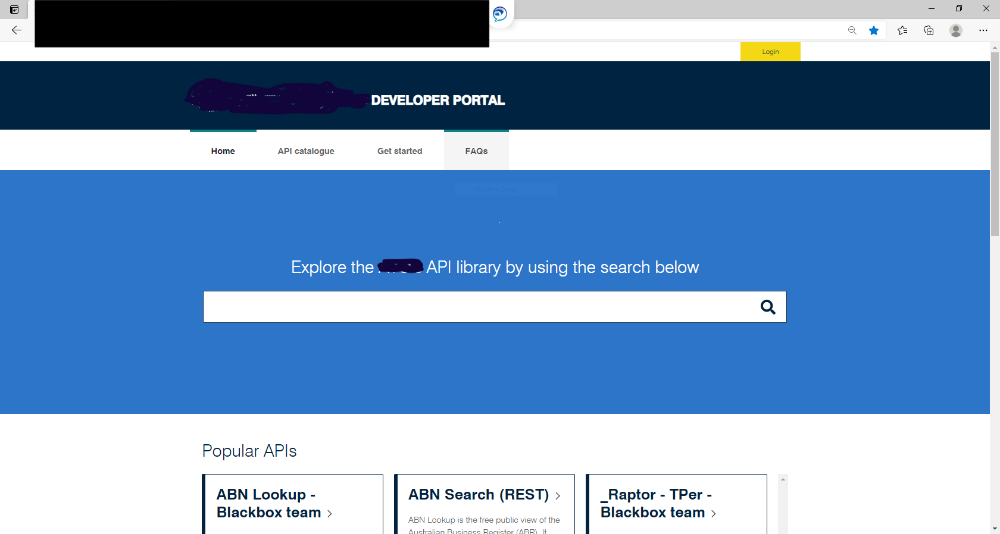

#### 2. Sign-in as a developer using login dis-ptb100@test.gov.au

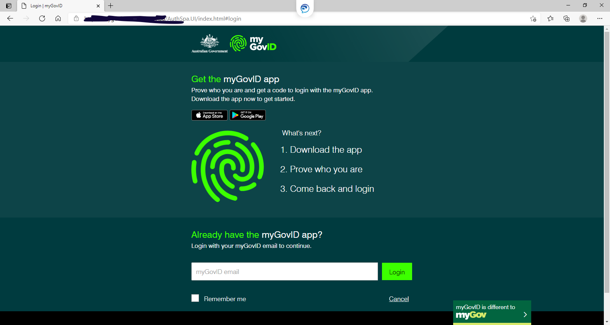
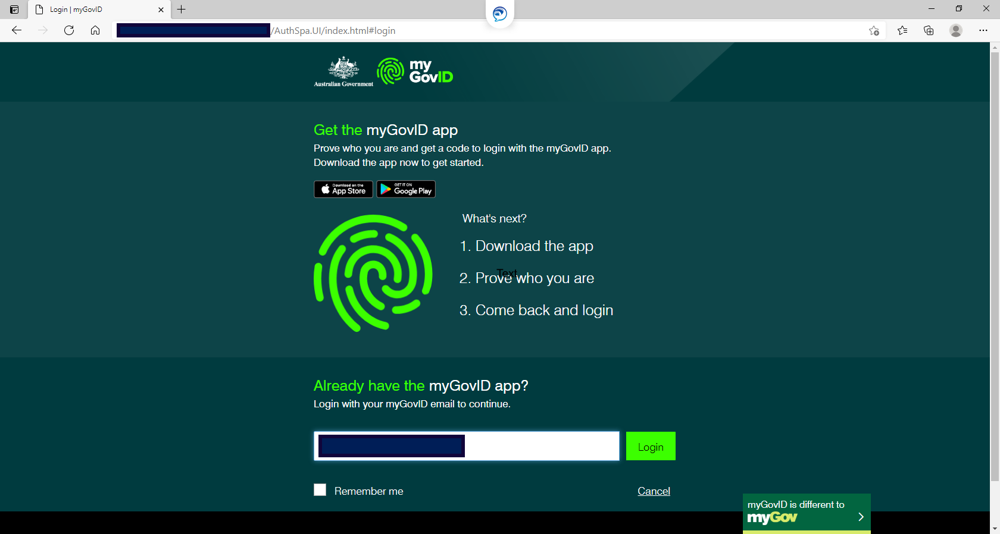

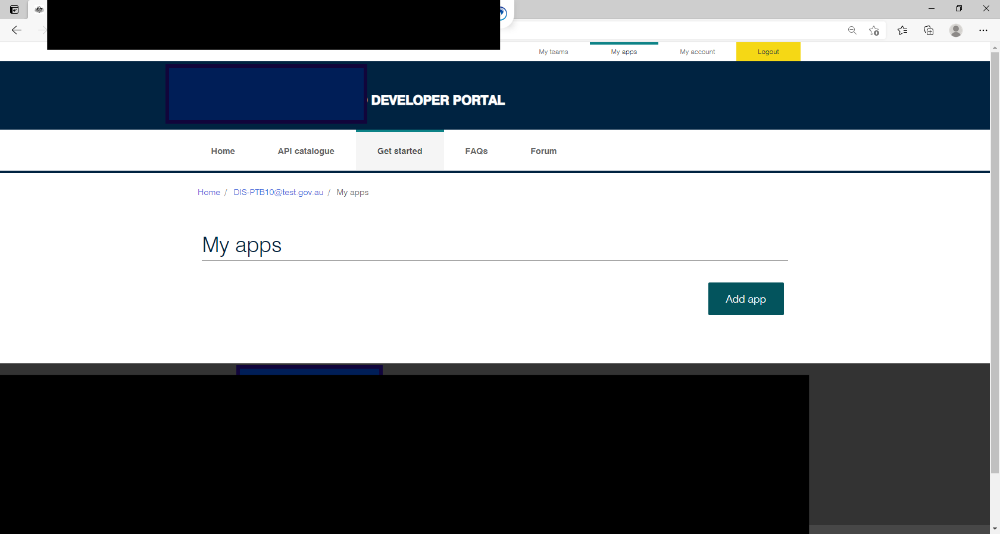
#### 3. Create an App & Subscribe to your API Product

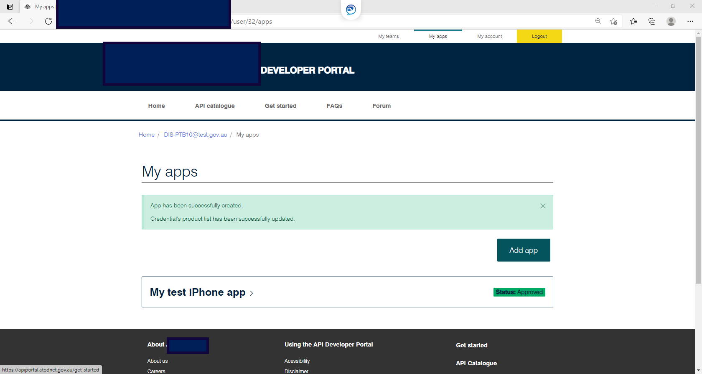

4. Get Access to you consumer key
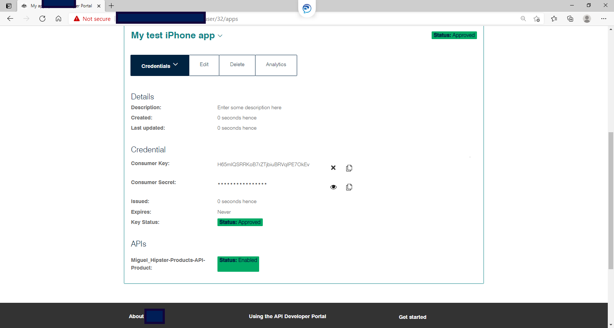

### Create DSP(Team) App (OPTIONAL - READ ONLY)

// TBD: This feature exists but is not covered in this lab. The DPO is responsible for onboarding DSPs(Teams) on to the platform. Ask your friendly neighborhood Terem instructor for more details or a demo.
#### 1. Browse to the developer portal
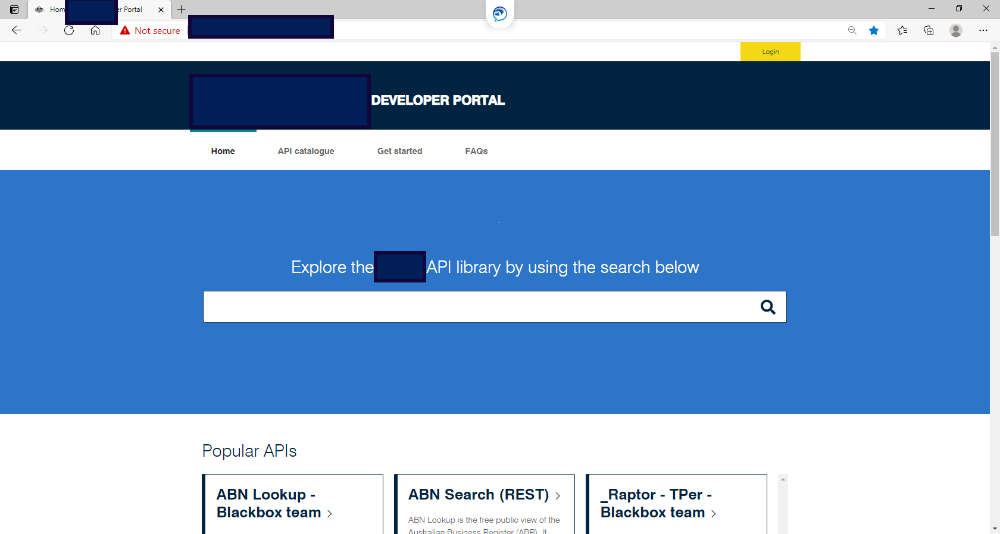

#### 2. Sign in as a DSP Team admin
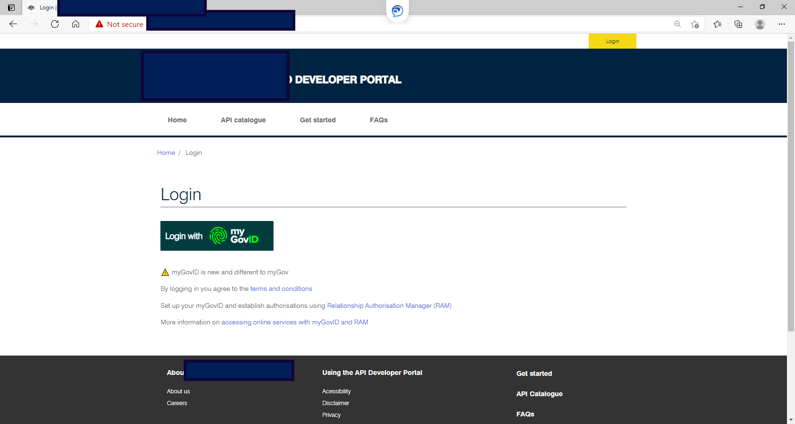

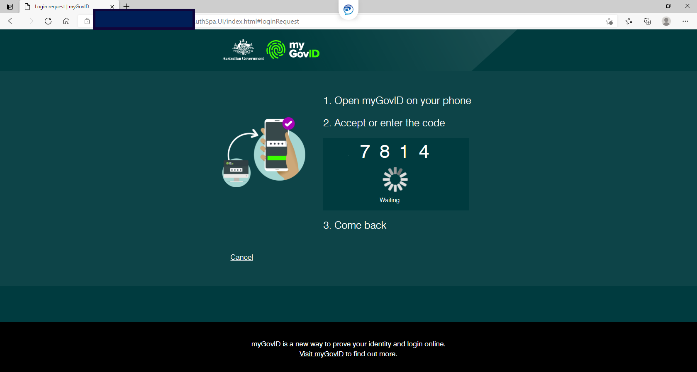
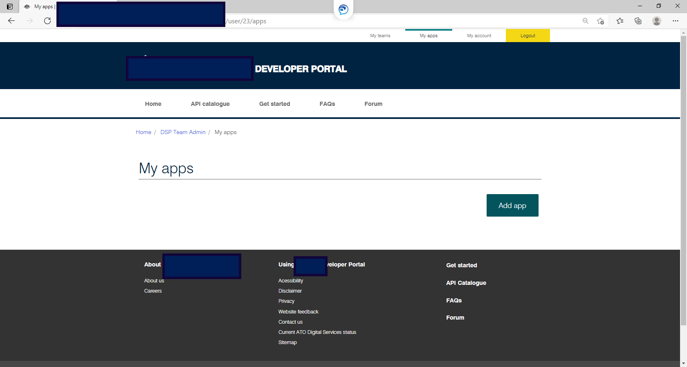

#### 3. Create an Team App & Subscribe to your API Product

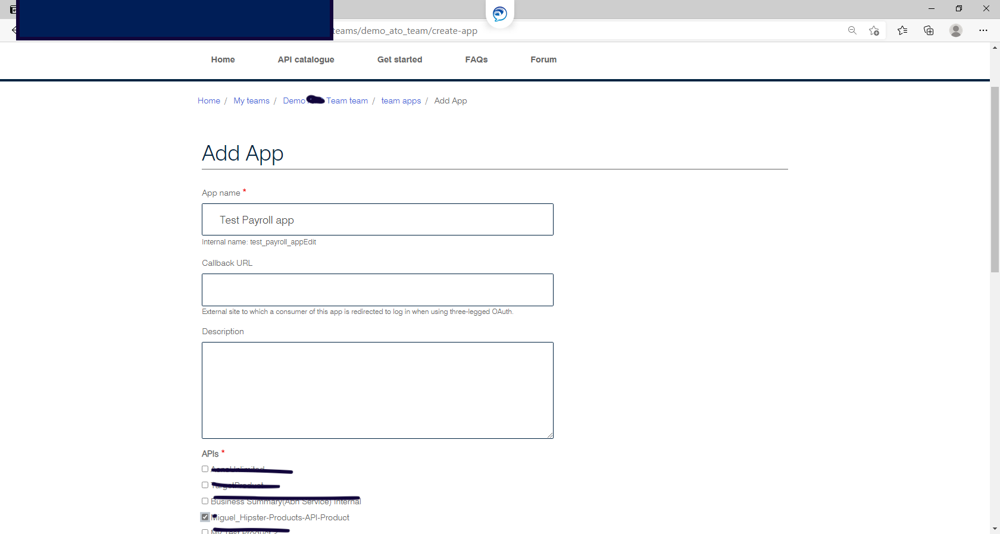

#### 4. Get access to your API Key + M2M credential
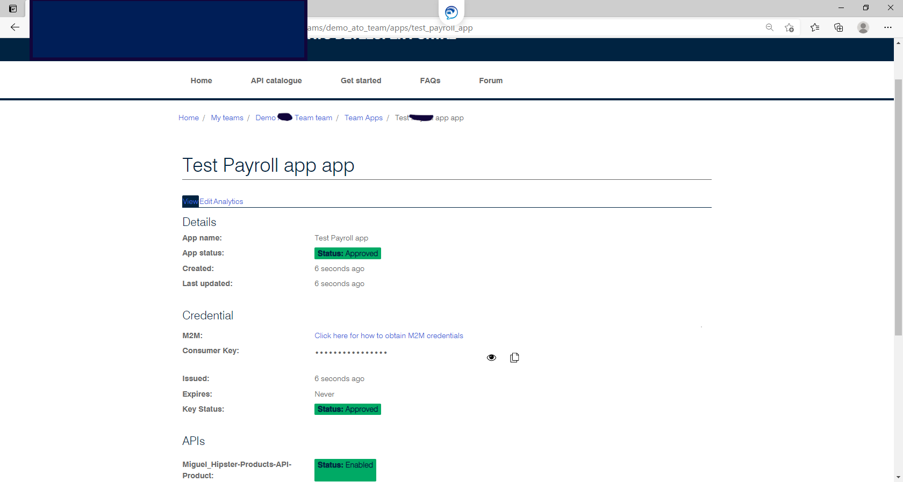

# Quiz

1. What are two reasons why you might publish multiple API products to the Developer Portal?

2. Changes made to OpenAPI Specification are made available in the Developer Portal automatically.  True or False?

# Summary

You’ve learned how to do the following:

* Browsed the Developer Portal and explored it's features

* Publish an API Product with an OpenAPI Specification

* Use the Developer Portal UI to browse the OpenApi Specification Snapshot as a developer.

