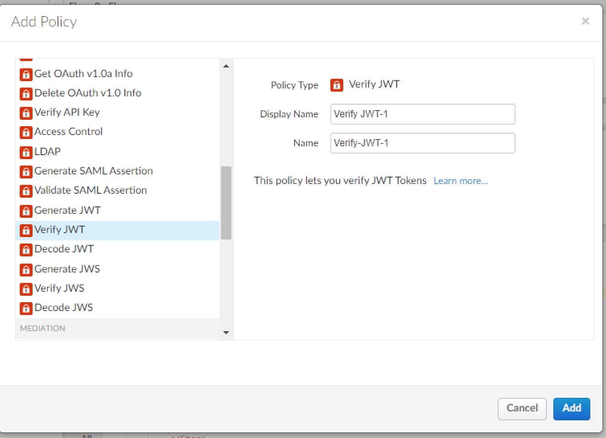
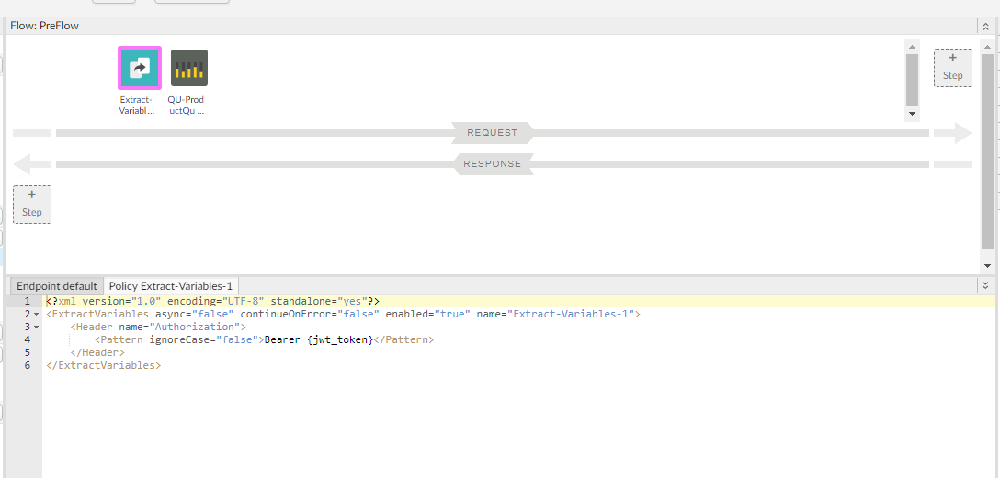
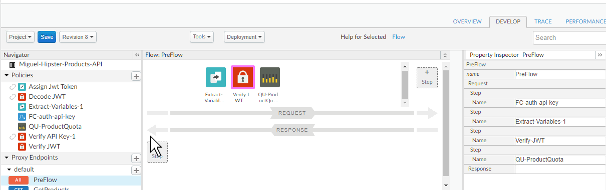
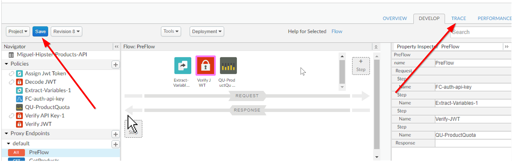

# API Security : DSG Security and Authentication Worlflow

*Duration : 30 mins*

*Persona : API Team/Security*

# Use case

You have an API that is consumed by trusted applications. You want to secure that API using the appropriate authentication mechanisms. 

# How can Apigee Edge help?

Apigee Edge quickly lets you secure your APIs using out of the box JWT/JWD policies. Both JWS and JWT are commonly used to share claims or assertions between connected applications. The JWS/JWT policies enables Edge API proxies to:

- Generate a signed JWT or JWS.
- Verify a signed JWT or JWS and claims within the JWS/JWT.
- Decode a signed JWT or JWS without validating the signature.

In the latter two cases, the policy also sets variables that allow additional policies, or the backend services themselves, to inspect the validated claims and to make decisions based on those claims.

When using the Verify JWS/JWT policy, an invalid JWS/JWT will be rejected and will result in an error condition. Similarly, when using the Decode JWS/JWT policy, a malformed JWS/JWT will result in an error condition.

# Instructions

As part of this lab, you will:
- Generate a Sample JWT token 
- Create a Request using yoru REST Client (Postman, Curl or similar) with an authorization Header containig the JWT token
- Secure the sample Hipster Products API with an JWT token verification policy. 

## Generate a JWT token
A JSON Web Token is a proposed Internet standard for creating data with optional signature and/or optional encryption whose payload holds JSON that asserts some number of claims. The tokens are signed either using a private secret or a public/private key pair., fr the purposes of thsi labs we will be using a public/private key pair for verification purposes. we will be using a free online tool that will help us generate and sign a JWT token that is then going to be validated by our proxy.


1. Visit the following url https://dinochiesa.github.io/jwt/ 


2. <a name="claims"></a>Under the "Decoded Payload" panel you will see all the claims that this JWT asserts, feel free to add any custom claims if you wish. some of the claims in here are needed for your token to ve valid, so don't remove any of them unless you know what you are doing ;) 
3. Set the encoding algorithm to RS256.
4. Set the Expiry to 60 mins (to give your self some time to get trough the rest fo the steps).
5. Click on the Left pointing Arrow to generate an encoded token. 
6. <a name="publickey"></a>Take Note of the public key from the private/public pair as youw ill need it in the next steps.

## Secure Hipster API with a JWT Verification Policy

1. Select **Develop** → **API Proxies** in the side navigation menu:


2. Select the previously created **{{your initials}}_Hipster-Products-API** proxy:


3. Click on the **Develop** tab:


4. Ensure that "**PreFlow**" is selected in the “**Proxy Endpoints**” window, and then click the **+Step** button above the “**Request**” flow:


5. Select the **"Verify JWT"** security policy, leave the default name, and then click **Add**:



6. Select the **"Extract Variables"** mediation policy, leave the default name, and then click **Add**:


7. Drag and drop the Extract-Variables policy so it is before the Product Quota policy


8. Click the Extract Variable step 



9. replace the poicy xml code with the following: 
```xml
<ExtractVariables>
   <Headername="Authorization">
      <PatternignoreCase="false">Bearer {jwt_token}</Pattern>
    </Header>
</ExtractVariables>
```
10. Drag and drop the VerifyJWT policy so it on the right of the Extract-Variables policy and before the Product Quota Policy.



11. replace the policy xml code withthe following:

    ```xml
    <?xml version="1.0" encoding="UTF-8" standalone="yes"?>
    <VerifyJWT name="Verify-JWT" enabled="true" continueOnError="false" async="false">
        <DisplayName>Verify JWT</DisplayName>
        <Algorithm>RS256</Algorithm>
        <Source>jwt_token</Source>
        <PublicKey>
            <Value>
    -----BEGIN PUBLIC KEY-----
    [public_key]
    -----END PUBLIC KEY-----
            </Value>
        </PublicKey>
    </VerifyJWT>
    ```
    replace `[public_key]` with the value of the public key in the public/private pair you used in the [first section](#publickey)  of this lab to generate the JWT token.

12. Cick on **Save**. After the proxy is saved, click the Trace tab in the upper right:



12. Click on the **Start Trace Session** button. Add /products to the end of the URL field.


## Test JWT Verification Policy 

##### Note: the following steps assume you are using postman as your rest client, different clients will have different ways of achieving the same result.

9. Open up your Rst Client 

11. Create a GET request  to the products endpoint of your Proxy.

12. Under the Authorization settings of your client (screenshot shows postman) include a Beare Token and repace the value of the token with the one you generated on the first section of this lab. **Note: refreh your token if it has allready expired**


13. **Alternative to Postman** if you do not have access to Postman an alternative way to test this scenario is by using the following powershell script. 
```
$headers = New-Object "System.Collections.Generic.Dictionary[[String],[String]]"
$headers.Add("Authorization", "Bearer [your_jwt_token]")
$response = Invoke-RestMethod 'http://apiptb.devtest.atohdtnet.gov.au/[your_initials]-hipster-products-api/products?apikey=[your_apikey]' -Method 'GET' -Headers $headers
$response | ConvertTo-Json
```

Copy the avobe code into a new file ,you will need to replace the relevant parameters:
- Valid api key as generated in previous labs
- Url to your proxy 
- JWT token generated in section 1 of this lab

save this file with a .ps1 extendion and execute from a powershell console.

14. As you execute the requests you should see them being traced inside of Apigees Trace Session Screen.


if everything goes well you should get a 200 response and a list of products .Try to modify your tocken to observe the policy rejecting the token.

## Bonus Points

Try to add specific claims to your JWT Token and modify your JWT verification Policy to validate this claims. refer to [Step 2](#publickey) in the first section.
