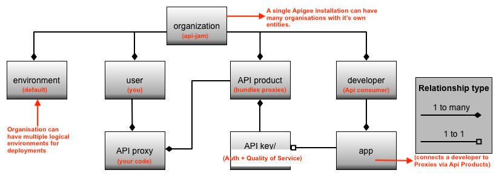

# Apigee API Jam Lab Guides

The original content has been borrowed from Googles API Jam repository on github.

These labs and the supporting material were intended to be run on the DSG  Platform. We will be running them in the Private Cloud Apigee Installation. There will be minor cosmetic and feature differences you will find while running the labs like the screenshots provided in the content vs what you see on screen will have slight variations. Feel free to catch an instructor if you get stuck.

If you are attending a Virtual Session if you are stuck, please 
* Use the chat room to express the issue you are facing. Someone in the chat room might help answer your questions.
* If you need further assistance, Direct Message one of the instructors, and invite them to a your webex room. 
* **Make sure you are logged into webex on the same computer as the on your are running the labs on**. You could then screen share and the instructor will try and debug the issue with you. 

## System Requirements
* A machine(Winodws/Linx) on the Organisation Network and is able to connect out the internet
* Browser - Google Chrome(preferred), Firefox(preferred) , Edge(Might have some issues)
* HttpClient - Fiddler/Postman OR cUrl/Powershell

## Agenda

** **
### [Introductions (9:30 am - 10:00 am)](#)
* Quick Introductions
* Setup for labs 
* A quick overview of the Apigee Entities we will work with today
  
  

** **

### [API JAM - API Management (10:00 am - 12:00 pm)](./Module-1) 
* Lab 1 - Create a Reverse Proxy with OpenAPI specification
* Lab 2 - Apps, API Products & API Keys
* Lab 3 - Manage tiered API Product subscription through API call quotas
* Lab 4 - Developer Experience
* Lab 5 - Measure API Program Success with Apigee Analytics

** **

### [Lunch (12:00 pm - 1:00 pm)](#)

** ** 

### [Api Jam - DSG security (1:00 pm - 2:00 pm)](./Module-2a) 
* Introduction to API Security
* Lab 1 - Throttle your API Traffic to prevent DoS, using Apigee Spike Arrest
* Lab 2 - DSG security exercise, something that mimics ATOs security using Signed JWT

** **

### [Discovery on project API (2:00 pm - 3:00 pm)](#)
* Discussions on APIs you intend to onboard onto the DSG

** **

## Self Paced Modules

The below modules could be used by the participants as self paced practice to get a deeper understanding of advanced Apigee topics.

** **
### [Module 2b - API Security Part 2](./Module-2b) 
* Lab 3 - Protect your APIs against content-based threats
* Lab 4 - JWT based API security
* Lab 5 - OAuth 2.0 based API security using Apigee as OAuth server, and an External Identity Provider for App end-user identity (OAuth 2.0 Password Grant Type)

** **

### [Module 3 - Advanced API Management Part 1](./Module-3) 
* Lab 1 - Global policy management using Shared Flows, Flow Hooks and Flow Callouts
* Lab 2 - Build composite APIs using Service Callouts and Proxy Chaining
* Lab 3 - API Message logging using the Apigee Stackdriver Extension
* Demo - API Monitoring & API Security Dashboard

** **

### [Module 4 - Advanced API Management Part 2](./Module-4) 
* Lab 1 - Route and Load Balancing across multiple API target backends using Target Server and Route Rule configurations
* Lab 2: API Monitoring & Security Dashboard (Note: API Monitoring & Security Dashboard features are not turned on for Trial orgs)
* Demo - Hosted Targets

** **

You can start with the first lab in Module 1 [API Design - Create a Reverse Proxy with OpenAPI specification](./Module-1/Labs/Lab%201)

#### Apigee Community 
If you have any questions/comments please visit https://community.apigee.com/index.html

